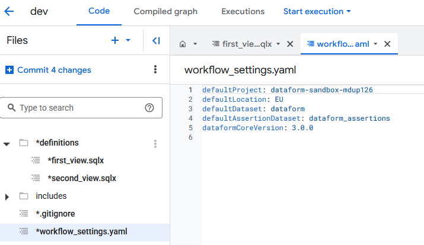
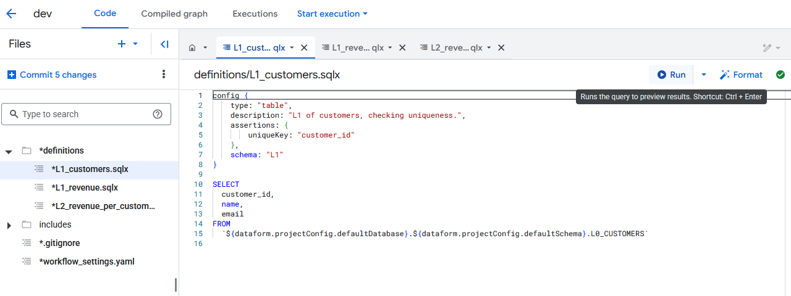

# Dataform Ready GCP Environment

[](https://opensource.org/licenses/MIT)

Quickly set up a Google Cloud Platform (GCP) environment using Terraform, specifically tailored for getting started with Dataform development and testing.


## Overview

This repository provides Terraform configurations to automate the creation of essential GCP resources needed to analyse data (Google Cloud Storage, BigQuery, Dataform). 

It aims to significantly reduce the initial setup time for developers wanting to explore or utilize Dataform on GCP.

After running the Terraform setup, you can perform a one-time manual step to create the Dataform workspace within the GCP console and then populate it with the provided sample Dataform project files.

## Features

*   **Automated Infrastructure** 
*   **Essential Resources:** Creates a dedicated Service Account with appropriate permissions, enables required APIs (Dataform, BigQuery), and sets up a BigQuery dataset.
*   **Sample Dataform Project:** Includes a basic Dataform project structure (`definitions`, `assertions`, etc. using files from `terraform/source_data/`) to get you started immediately.
*   **Fast Start:** Designed to minimize setup friction and accelerate your Dataform learning or development process.

## Prerequisites

Before you begin, ensure you have the following installed and configured:
1.  **GCP Account:** A Google Cloud Platform account with billing enabled.
2.  **Google Cloud SDK (`gcloud`):** [Installation Guide](https://cloud.google.com/sdk/docs/install)
    *   Make sure you are authenticated: `gcloud auth login`
3.  **Terraform:** [Installation Guide](https://learn.hashicorp.com/tutorials/terraform/install-cli)
## Getting Started: Step-by-Step Guide

Follow these steps to set up your Dataform-ready environment:

**Step 1: Clone the Repository**

```bash
git clone https://github.com/mpdup/dataform-ready-gcp.git
cd dataform-ready-gcp/terraform
```

**Step 1: Configure and execute terraform**

Go into `terraform.tfvars` and set your project-id and billing-id. 

Execute commands:

```
terraform init
```

Optional - If you don't want to create a new project but instead want to deploy infrastructure into an xisting project, first execute:

```
google_project.sandbox_project your-existing-project-id
```


```
terraform plan

terraform apply
```

This will:
- Create a GCP Project if not created already.
- Enable APIs for Dataform and BigQuery.
- Create a dedicated Service Account for Dataform.
- Grant necessary IAM roles to the Service Account:
    - `roles/bigquery.dataEditor`
    - `roles/bigquery.jobUser`
    - `roles/dataform.editor`
    - `roles/storage.objectViewer`
- Create Google Cloud Storage (GCS) bucket, and save `customers.csv` and `revenue.csv` to it
- Create a BigQuery dataset (`L0_raw_data`) and 2 external tables containing data from source csv files 
    - `L0_CUSTOMERS`
    - `L0_REVENUE`
- Create Dataform repository

*Now you have a functioning dataform repository. If you are familiar with dataform feel free to skip next steps. If you wish to follow example use case, continue...*

**Step 2: Set up dataform pipelines**

Navigate to created dataform dataform-sandbox-repository and manually create development workspace and within that click initialize workspace. This will create basic dataform structure.


Change workflow_settings.yaml to 

```
defaultProject: YOUR_PROJECT_NAME_ID_HERE
defaultLocation: europe-west4
defaultDataset: L0_raw_data
defaultAssertionDataset: dataform_assertions
dataformCoreVersion: 3.0.0
```

And manually create recreate the files in dataform subfolder.
- `L1_customers.sqlx`
- `L1_revenue.sqlx`
- `L2_revenue_per_customer.sqlx`

Now you have 
Source Files in GCS -> L0 in Bigquery -> L1 -> L2 data pipeline.

